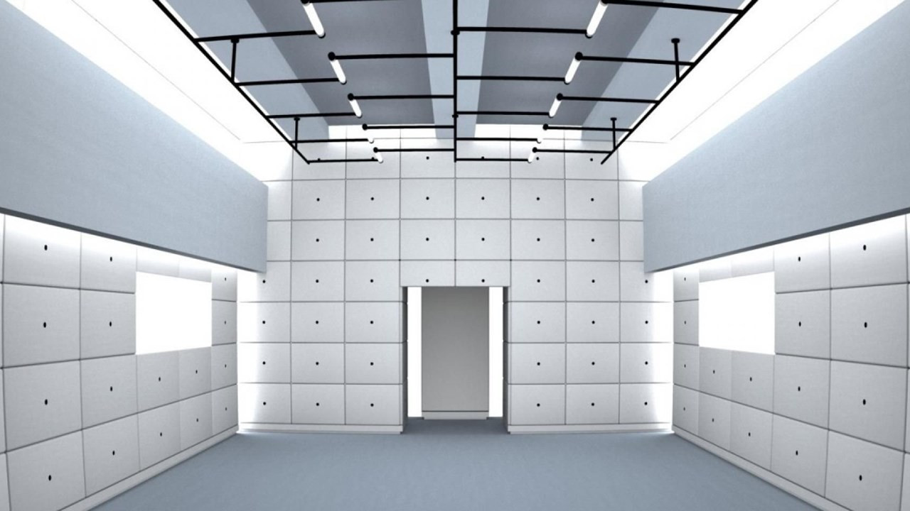

# Virtual Office

## 概要

* 物理カメラ
{:height="50%" width="50%"}

* 背景
{:height="50%" width="50%"}

* 仮想カメラ出力
{:height="50%" width="50%"}

## 準備

* 仮想カメラのセットアップ

~~~
$ sudo apt install v4l2loopback-dkms
$ sudo modprobe v4l2loopback exclusive_caps=1
~~~

* 依存ライブラリのインストール

~~~
$ poetry update
~~~

## 実行

~~~
$ poetry run main bg.jpg
~~~

* 物理カメラを指定

~~~
$ poetry run main --camera=/dev/video2 bg.jpg
~~~

## Tips

* カメラをリスト

~~~
$ v4l2-ctl --list-devices
~~~

* カメラのフォーマットをリスト

~~~
$ v4l2-ctl -d /dev/video0 --list-formats-ext
~~~

* カメラの解像度を変更

~~~
$ v4l2-ctl -d /dev/video0 --set-fmt-video=width=1280,height=720 --set-parm=10
~~~
